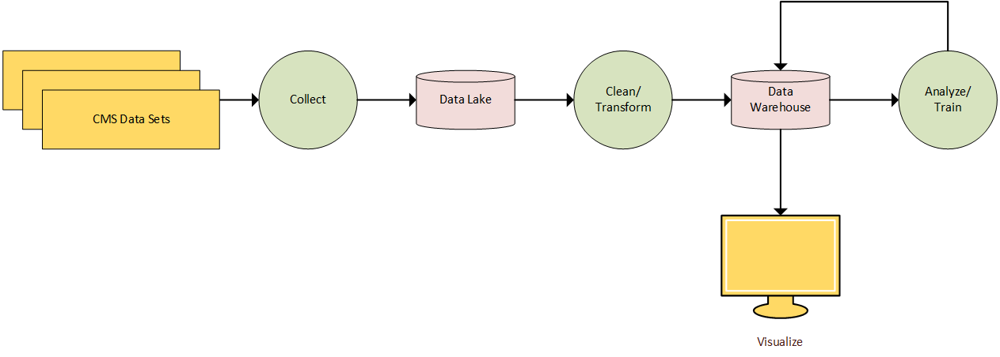
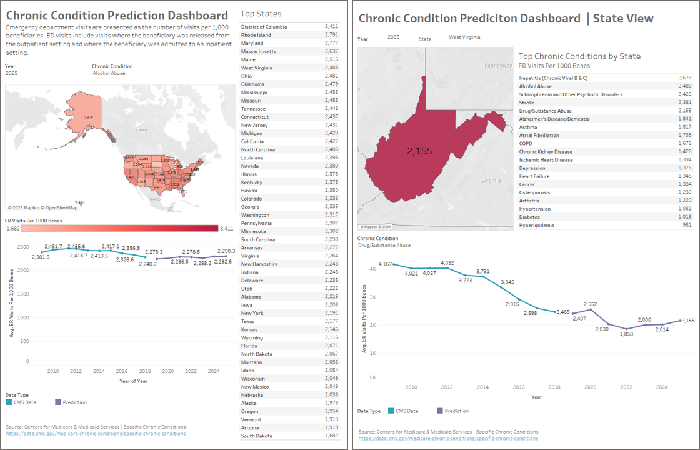

# Statewide Chronic Condition Trends

The purpose of the Statewide Chronic Condition Trend data pipeline is to collect, clean, store, analyze, predict, and visualize healthcare data throughout the United States.

## Description

The goal of the project is to provide future trends of chronic conditions based on historical data and visualize the information in an interactive dashboard. As more data is available, the pipeline can add new information and then use the information to train its algorithm to make better predictions with future data. Once completed this pipeline could be used to help determine future trends across the country and help populations with growing levels of chronic conditions.

Once the pipeline is complete, the goal is to have an integrated data pipeline process. Once that runs all processes back-to-back without the need to break data flow. The system will make data-driven decisions correctly provide high-value trends and fill the whole of unavailable data sets. I also hope to gain a better understanding of the data pipeline process and gain knowledge to build similar or more advanced systems in the future.

## Getting Started

### Dependencies

* Pandas: 2.2.3
* NumPy: 1.26.4
* Keras: 2.10.0

### Installing

* Download files into a working directory.

### Executing program

#### Local Machine
* Run:
```
python start_local.py
```

#### Airflow
* Copy files to dag directory:
  * dag.py
  * projectAdminInfo.py
  * batch_ingest_CMS.py
  * transform.py
  * featureExtraction_CMS.py
  * build_train_model_CMS.py
  * predict_CMS.py
  * load_db_CMS.py
* Insert storage information in projectAdminInfo.py
* Run Airflow & Trigger CMS Dag 
* Download 'vis-data.csv' from the data visualization folder. ("DataVisualization")

## Authors
[Jacob Hall | jhallgd](https://github.com/jhallgd)

## Version History

* 0.1
    * Initial Release

## License

This project is licensed under the Jacob Hall License - see the [LICENSE](LICENSE) file for details

## Data Pipeline Infographic


## Tableau Example
[Tableau dashboard](https://public.tableau.com/views/ChronicConditions_17015398817220/Overall?:language=en-US&publish=yes&:display_count=n&:origin=viz_share_link)  using collected and predicted data.

